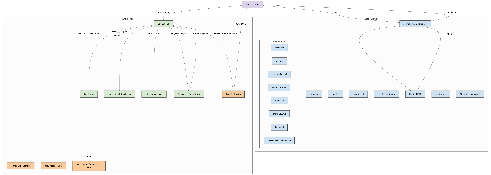

# InterXAI: A Human-Centered Tool for Intertextual Explanation and Model Critique

## Overview
InterXAI is a hybrid web-based tool that empowers users to explore and compare machine-generated explanations (XAI) and human intertextual commentary on AI-predicted outputs. It bridges the gap between explainability and interpretability using critical and cultural theory.

## Features
- Upload or paste texts for analysis
- Generate explanations using SHAP, LIME, or attention maps
- Annotate and compare human vs. machine interpretations
- Link commentary to literary, historical, and cultural texts
- Export annotated comparisons in PDF/HTML/JSON

## Installation
```bash
pip install -r requirements.txt
streamlit run app/ui_components.py
```

## Folder Structure
- `app/` – Core Python modules (XAI, interpretation, UI)
- `static/` – CSS, JS, and visualization assets
- `templates/` – HTML templates (for Flask-based use)
- `data/` – Text data and annotation exports
- `tests/` – Unit and integration tests

## 🧱 System Design


## License
MIT License
